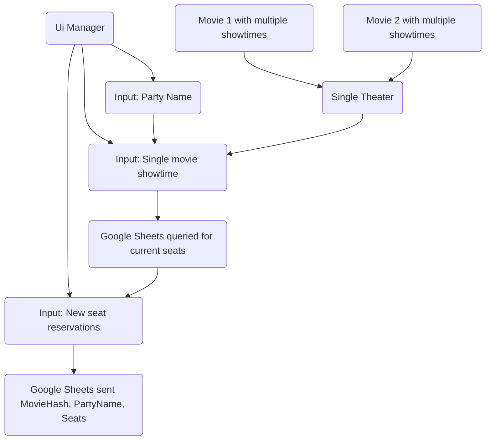

# Goal

Make reservations for theater seats.

# Try it

- WebGL: https://feddas.github.io/TheaterReservations
- Desktop: https://github.com/Feddas/TheaterReservations/releases/download/1.0/TheaterReservationsBuiltForPC1.0.zip

# Steps

1. Open the weblink or the \*.exe
2. Choose name you'd like seats to be reserved under.
3. Choose day you'd like to reserve seats for a new movie. To modify previous reservations, select the day of that reservation.
4. Choose movie and time you'd like to see it that day. To modify previous reservations, select the movie & time of that reservation.
5. Click to toggle your reservation for seats. Seat colors are as follows:
    |     |     |
    | --- | --- |
    | White | Available to be reserved. |
    | Green | Already reserved by you. |
    | Red | Reserved under a different name. You can not modify this seat. |
6. Click "Finished" button to be returned back to the "Choose name" page.

# Requirements

1. Seat reservations need to persist and be stored in the cloud. Across all users and all app sessions. Maybe google sheets for the backend?
2. Unit Tests included for checking ability to pull data.
3. Unit Tests included for checking ability to read reservations from google sheets.

# Known issues

1. For whatever reasons. Seat reservation data is not pulled on the first viewing. For it to be pulled a seat reservation needs to be "Finished". Then when the same movie time is viewed again, in that same session, that seat, and all other reservations will be visible. This is likely a bug with interacting with the backend, Google Sheets. I was unable to figure it out.
2. The UX isn't as good as it should be.
    1. Should be able to press enter after entering your name instead of having to click "continue"
    2. The data options look too sparse.
    
# Concerns

1. Someone can remove someone elses reservations by choosing the same reservation name.
2. If internet is currently unavailable, there is no fallback to temporarily save locally or queue reservations for when internet is restored.
3. Theater showings match to reservations by using a hash that could be the same for two different showings. However, making a hash makes it easy to recreate a showing that was moved or deleted. An auto-incrementing ID and a GUID both suffer from not being able to be regenerated if the same movie and time is put in.

# Architecture

Movies are syncronized using a hash that is built using the movie name and showing datetime. Reservations are a list of seats identified to a party name combined with the movie hash.

Movie showtimes are stored in scriptable objects. There is a scriptable object for a the single theater that stores all movies and times available. This is what is used to build the UI for the user to choose which movie they would like to see.

The movie showing the user has chosen determines which seat reservations are available on the next screen. The user can click as many open or self-reserved seats as they like to toggle them. When they click finish, the reservations under their name are updated on Google Sheets.

# Decisions

### UIToolkit

Decided to use UIElements / UIToolkit despite not having used it before. It's something I wanted to check out, was able to allocate time beyond the 6 hours, and I felt the assessment hints that it'd be heavily used by who is hired for this job. Learning UIToolkit enough to do this assessment took more time than expected.

### Backend used for Reservations

I chose Google Sheets for the backend because I expect the app to not have more than 1 or 2 concurrent users with less than 100 transactions per day. The performance turned out to be a bit worse than I expected. The Google API can only use a test account without completing a verification process. Maybe bad perf is due to using a test account.

### Backend used for Showtimes

Went with a locally saved scriptable object for the list of available movie times in an attempt to save time. Reservations can be made and modified for movie times that have already past. This was done so the app concept can still be viewed after the last stored showing time. This worked well.

# Using source code

To run this project in the Unity Editor or make your own builds you'll have to do some additional work.
1. This project relies on a Google Sheets backend. If you were not sent keys (file to be placed at `Assets/Google Sheets to Unity/Resources/GSTU_Config.asset`) you'll need to create them as described in https://docs.google.com/document/d/1N0qw0OibqMp8SSA7Nwh7fhKObg2e-FSGQUeYr9-zN8Y .

# Libraries

The following libraries were used for this project:
1. Google Sheets API: https://assetstore.unity.com/packages/tools/utilities/google-sheets-to-unity-73410 / https://github.com/pbhogan/TinyJSON
2. Inspector DateTime suppport: https://gist.github.com/EntranceJew/f329f1c6a0c35ac51763455f76b5eb95

    
# Repository

GitHub: https://github.com/Feddas/TheaterReservations
